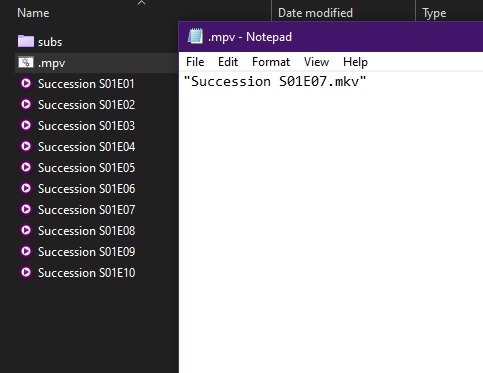
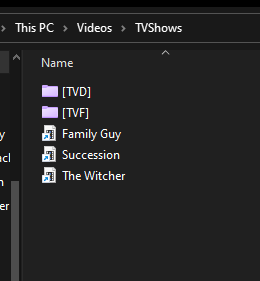

# Ep-history.lua

It is originally coded by [yuukidach](https://github.com/yuukidach/mpv-scripts) and [sorayuki](https://github.com/sorayuki-winter/mpv-plugin-bookmark). And I just added some very simple tweaks to the code that make a lot of better in terms of how I watch TV shows and I want to share it with you.

This script helps you to create a history-batch file `.mpv.bat` in the video folder. The next time you want to continue to watch it, you can just double click the batch file and the script will lead you to the video played last time.
Note that this script works only on windows because it's a (.bat) file, and you can make it work on any system just by changing the syntax





Like the screenshot, you can create a shortcut of the batch file change its name and icon then put it anywhere your system.

In order to resume from the exact point of the watching progress in target episode, you just need to add a line in the mpv.conf

``` txt
save-position-on-quit
```

## Other scripts I recommend

[autoload](https://github.com/mpv-player/mpv/blob/master/TOOLS/lua/autoload.lua): Automatically load playlist entries before and after the currently playing file, by scanning the directory.
